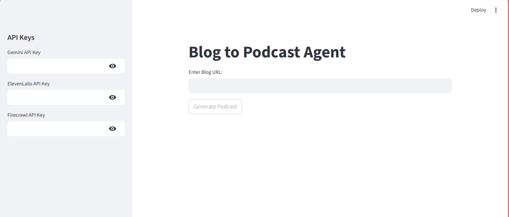

# 🎙️ Blog to Podcast Agent

Convert any blog post into a podcast automatically using **AI summarization + text-to-speech**.

This project uses:

* **Streamlit** → UI
* **Gemini (Google AI)** → Blog summarization
* **Firecrawl** → Blog scraping
* **ElevenLabs** → Text-to-Speech audio generation
* **Agno Agent** → Tool-enabled AI workflow

---

## Preview


---

## 🚀 Features

* 🔗 Input any blog URL
* 🌐 Automatically scrape blog content
* 🧠 Generate concise, podcast-friendly summaries using AI
* 🎧 Convert summary into realistic speech
* ⬇️ Download generated podcast as MP3
* 📝 View generated summary inside the app

---

## 🏗️ Architecture

```
User Input (Blog URL)
        ↓
   Firecrawl Tool
        ↓
   Gemini AI Model
        ↓
 Podcast Summary
        ↓
   ElevenLabs TTS
        ↓
     MP3 Download
```

---

## 📦 Installation

### 1️⃣ Clone repository

```bash
git clone https://github.com/shushilshah/blog_to_podcast_ai_agent.git
cd blog-to-podcast_ai_agent
```

---

### 2️⃣ Create virtual environment (recommended)

```bash
python -m venv venv
```

Activate:

**Windows**

```bash
venv\Scripts\activate
```

**Mac/Linux**

```bash
source venv/bin/activate
```

---

### 3️⃣ Install dependencies

```bash
pip install -r requirements.txt
```

---

## ▶️ Run the Application

```bash
streamlit run app.py
```

The app will open in your browser automatically.

---

## 🔑 Required API Keys

You need the following API keys:

* Gemini API Key (Google AI)
* Firecrawl API Key
* ElevenLabs API Key

You can enter them directly in the Streamlit sidebar when running the app.

---

## 🧠 How It Works

1. User enters a blog URL.
2. Firecrawl extracts blog content.
3. Gemini summarizes the blog into conversational podcast text.
4. ElevenLabs converts the summary into audio.
5. User downloads the generated podcast.

---

## 📁 Project Structure

```
blog-to-podcast/
│
├── app.py              # Streamlit application
├── requirements.txt    # Dependencies
└── README.md           # Project documentation
```

---

## ⚠️ Known Issues

* Free-tier APIs may block requests if unusual activity is detected.
* Large blogs may exceed token limits.
* Some websites block scraping.

---

## 🧩 Future Improvements

* 🎙️ Multiple voice selection
* 🧠 Custom podcast style (casual, professional, news)
* 📄 Export transcript
* ☁️ Cloud deployment
* 🎧 Background music support

---

## 🤝 Contributing

Pull requests are welcome.
For major changes, please open an issue first to discuss what you would like to improve.

---

## 📜 License

MIT License

---

## ⭐ Acknowledgements

* Streamlit
* Google Gemini
* Firecrawl
* ElevenLabs
* Agno Framework

---

Made with ❤️ using AI.
